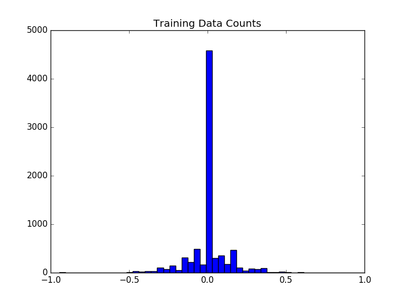

# Project 3 for Udacity Self-Driving car Nanodegree

TODO

# Acknowledgements 

* Nvidia [model](https://arxiv.org/pdf/1604.07316v1.pdf)
* Comma.ai [model](https://github.com/commaai/research/blob/master/train_steering_model.py)
* Udacity Forum [cheat sheet](https://carnd-forums.udacity.com/questions/26214464/behavioral-cloning-cheatsheet)
* Slack #p-behavioral-cloning channel (very helpful!)
