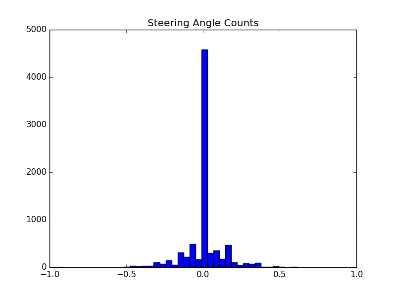

# Udacity Self-Driving car Nanodegree Project 3: Behavior Cloning

This was a very interesting project.  At times it was very challenging, but it is amazing to see the car drive itself.  Even knowing (mostly) how it works I am surprised to see it drive around the track.  Especially track 2 which I did not train on at all.  Before starting this project, if someone had told me that training a neural network on nothing but camera images and steering angles, I would not have believed them.  Now that I've seen it work I can see why deep neural networks are such an important topic for self-driving cars.

# Acknowledgements 

I would like to start by acknowledging the amazing sources I found when working on this project.  The course material was amazing, and I am continually amazed at the caliber of the other students in this course.  So the first to sources were in fact those students:

* Udacity Forum P3 [cheat sheet](https://carnd-forums.udacity.com/questions/26214464/behavioral-cloning-cheatsheet)
* Slack #p-behavioral-cloning channel (very helpful!)
* [Write up](http://davidaventimiglia.com/carnd_behavioral_cloning_part1.html) by student David Ventimiglia 

The cheat-sheet posted to the forum and the write-up by David were very helpful.  I didn't end up using the code from the write-up, but the main take-away was to encourage me to start small for this project.  Starting with these hints I had a very good start.

# Starting Out

* I wrote a simple pre-process python script to sort and plot images
* I started with just 30 training images (10 left turns, 10 right turns, 10 center)
* I started with a trivial network model that I could understand and train on my laptop
* I rehearsed running the simulator in autonomous mode right away with the simple model

Here is a look at the simple model I started with:
```
Layer (type)                     Output Shape          Param #     Connected to                     
==========================================================================================
lambda_1 (Lambda)                (None, 66, 200, 3)    0           lambda_input_1[0][0]             
__________________________________________________________________________________________
convolution2d_1 (Convolution2D)  (None, 32, 99, 24)    672         lambda_1[0][0]                   
__________________________________________________________________________________________
elu_1 (ELU)                      (None, 32, 99, 24)    0           convolution2d_1[0][0]            
__________________________________________________________________________________________
Flatten (Flatten)                (None, 76032)         0           elu_1[0][0]                      
__________________________________________________________________________________________
Output (Dense)                   (None, 1)             76033       Flatten[0][0]                    
==========================================================================================
Total params: 76,705
Trainable params: 76,705
Non-trainable params: 0
__________________________________________________________________________________________
```

Even with this simple network, and only 30 images I was amazed that the model was able to drive the simulator, and stay in the middle of the road.  Of course it didn't make it very far in the track, but I had proven to myself that it was possible.

With this simple, quick-turnaround setup, I was able to quickly look at images, experiment with cropping, brightness, image size, and data augmentation.  I was able to play with the python generators which I had never used before.  When doing batches of just 10 images I was able to better understand how the generators worked and how to tune it for my needs.

## Training Data

I used the beta version of the simulator so that I could use the mouse to get the steering angles more natural.  Here are a couple of examples:

Nice center driving:


Recovery from the right-side:


From these images it looked like cropping the top and bottom would be helpful for the training.  It looks like most students did crop out the sky and hood, so I went ahead with the plan and removed 60 pixels off the top, and 20 from the bottom: 


After getting some training examples I decided that I should just use the Udacity training image set, so I downloaded the images and did a histogram plot.



From the histogram I noticed that the majority of the samples were simple straight-ahead driving with no steering angle.  In order to better train the model I decided to augment any cases that the car was actually steering and recovering back to the center.  I also did some randomness on brightness since all the images were pretty bright.  


## Network Model

Since I am very new to neural networks, I read articles and papers on what people were using for car steering.  It looked like the dominant answers were the NVIDIA and the Comma.ai models.  Both models looked very interesting, so I modeled them both and wrote my training script so that I could train both of them and compare the results.  

* Nvidia [model](https://arxiv.org/pdf/1604.07316v1.pdf)
* Comma.ai [model](https://github.com/commaai/research/blob/master/train_steering_model.py)


## Training

I used a python generator to load images and steering angles.  I also did a small amount of data augmentation and image processing for each batch going out of the generator.  The full generator pipline:

* loop over rows in the training log:
    * randomly select the left, right, or center camera
    * crop the top 60 pixes, and 20 bottom pixels out
    * resize the image to 66x200
    * randomize the brightness level
    * for non-center steering cases: Add a flipped version of the image and steering

I used my AWS g2.2xlarge instance to train the models.  There were 8036 data items in the Udacity training set, but with data augmentation I decided on 20,000 images per epoch with a batch size of 250 images.  Since the NVIDIA model did not have any dropout layers, I only used 8 epochs to train to avoid over-fitting the model.  It took many hours of trial and error before arriving at these training parameters since my experience is still pretty low.

## Results

After training the NVIDIA model and the Comma.ai model, the NVIDIA model was able to complete many laps of the test track.  The Comma.ai model was not able to complete a single lap.  So I decided to baseline the NVIDIA model for this project.  It would take a different training approach if I were to get the Comma.ai model trained properly.  

To my amazement, the NVIDIA model was also able to drive around the second test track!  I didn't use any images from track 2, so I was very surprised that it was able to drive the track.  

# Rubric

At this point I will go through the rubric and add comments about my model.

## Required Files

You will find the model.py file which did all the training for my models.  You will also see the drive.py file which I modified in order to make sure the images were cropped and resized to match my model.  I also have a model.json and model.h5 that were generated on the AWS instance after training.  You'll notice they are actually symbolic links to the nvidia.json and nvidia.h5 files respectively.  This README.md file is my write up file.

## Quality of Code

The model provided can drive the simulation.  You can run the simulation with:

    python drive.py model.json


The model.py file does use a generator to yield batches of images to the training pipeline.  I have organized the code and commented where helpful.

## Model Architecture and Training Strategy

1. I used the NVIDIA model. The first layer is a normalization lambda for each pixel in the input images.  After normalization there are 5 convolutional layers, and they used exponential linear units (ELU) for activation and non-linearity after each layer.

2. When starting the project I experimented with training and validation splits, but it did not improve the overall performance of the model to drive the car.  So I switched to feeding all images to the training pipeline, and used the epoch loss as the metric for convergence.  Since the NVIDIA model does not use dropout layers, I used more images per epoch, and reduced the number of epochs to only 8 to avoid overfitting.  The loss at the end of 8 epochs was 0.033.  

3. Since I was running on a GPU computer, the Adam optimizer was used for training.

4. See above discussion about data augmentation for ensuring there was enough training data for car recovery.

## Architecture and Training Documentation

1. This README.md file covers all of my process and thinking for this project.

2. I used the NVIDIA neural network model.  Here is a visualization of the model:
```
Layer (type)                     Output Shape          Param #     Connected to                     
==========================================================================================
lambda_1 (Lambda)                (None, 66, 200, 3)    0           lambda_input_1[0][0]             
__________________________________________________________________________________________
convolution2d_1 (Convolution2D)  (None, 31, 98, 24)    1824        lambda_1[0][0]                   
__________________________________________________________________________________________
elu_1 (ELU)                      (None, 31, 98, 24)    0           convolution2d_1[0][0]            
__________________________________________________________________________________________
convolution2d_2 (Convolution2D)  (None, 14, 47, 36)    21636       elu_1[0][0]                      
__________________________________________________________________________________________
elu_2 (ELU)                      (None, 14, 47, 36)    0           convolution2d_2[0][0]            
__________________________________________________________________________________________
convolution2d_3 (Convolution2D)  (None, 5, 22, 48)     43248       elu_2[0][0]                      
__________________________________________________________________________________________
elu_3 (ELU)                      (None, 5, 22, 48)     0           convolution2d_3[0][0]            
__________________________________________________________________________________________
convolution2d_4 (Convolution2D)  (None, 3, 20, 64)     27712       elu_3[0][0]                      
__________________________________________________________________________________________
elu_4 (ELU)                      (None, 3, 20, 64)     0           convolution2d_4[0][0]            
__________________________________________________________________________________________
convolution2d_5 (Convolution2D)  (None, 1, 18, 64)     36928       elu_4[0][0]                      
__________________________________________________________________________________________
elu_5 (ELU)                      (None, 1, 18, 64)     0           convolution2d_5[0][0]            
__________________________________________________________________________________________
flatten_1 (Flatten)              (None, 1152)          0           elu_5[0][0]                      
__________________________________________________________________________________________
dense_1 (Dense)                  (None, 1164)          1342092     flatten_1[0][0]                  
__________________________________________________________________________________________
elu_6 (ELU)                      (None, 1164)          0           dense_1[0][0]                    
__________________________________________________________________________________________
dense_2 (Dense)                  (None, 100)           116500      elu_6[0][0]                      
__________________________________________________________________________________________
elu_7 (ELU)                      (None, 100)           0           dense_2[0][0]                    
__________________________________________________________________________________________
dense_3 (Dense)                  (None, 50)            5050        elu_7[0][0]                      
__________________________________________________________________________________________
elu_8 (ELU)                      (None, 50)            0           dense_3[0][0]                    
__________________________________________________________________________________________
dense_4 (Dense)                  (None, 10)            510         elu_8[0][0]                      
__________________________________________________________________________________________
elu_9 (ELU)                      (None, 10)            0           dense_4[0][0]                    
__________________________________________________________________________________________
dense_5 (Dense)                  (None, 1)             11          elu_9[0][0]                      
==========================================================================================
Total params: 1,595,511
Trainable params: 1,595,511
Non-trainable params: 0
__________________________________________________________________________________________
```
This model uses a lambda function to normalize every pixel in the input images, and then proceeds into 5 2D-convolutional layers.  The first 3 convolution layers use a 5x5 filter with 24, 36, and 48 filters respectively.  There are then 2 convolution layers that are 3x3 in size with 64 filters.    The model is then flattened and fed into 4 fully-connected layers before going into the final single-output layer.  After each and every layer the exponential linear unit (ELU) is used for activation.

3) See the above discussion about the training data and data exploration.

## Simulation

I watched the model drive the car around the track for several laps.  The car seems to wander back-and-forth across the road a little bit, but it is able to stay on the track.

The car was able to drive on Track Two as well.  I had to increase the throttle as there is a point where it won't make it up a hill with the 0.2 throttle setting.

